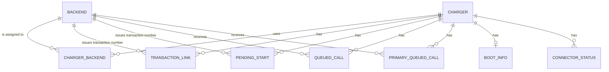

# Entity Model

The proxy has no database. Charger, backend, and assignment configuration comes from the configuration file; runtime state is persisted per charger. Entities below describe both.

## Entity Relationship Diagram

### CHARGER

A charge point on the allowlist that may connect through the proxy.

| Attribute | Description | Data Type | Length/Precision | Validation Rules |
|-----------|-------------|-----------|------------------|------------------|
| id | Charger id used in the connection address | String | 64 | Primary Key |
| password | Optional password the charger must present, read from the environment | String | - | Optional |

### BACKEND

A named Primary or Secondary Backend to which the proxy connects.

| Attribute | Description | Data Type | Length/Precision | Validation Rules |
|-----------|-------------|-----------|------------------|------------------|
| id | Unique identifier for the configured backend | Long | 19 | Primary Key, Sequence |
| name | Backend name used in configuration, logs, and errors | String | 100 | Not Null, Unique |
| address | Backend WebSocket address | String | - | Not Null |
| auth_mode | Backend authentication method | String | 30 | Not Null, Values: None, Password, Charger Credentials |
| password_env | Environment variable containing the backend password | String | 100 | Optional |
| call_timeout | Maximum wait for a backend answer, in seconds | Decimal | 10,2 | Not Null |

#### Constraints

- A password environment variable is required when the authentication method is Password.
- Charger credentials may only be forwarded to the Primary Backend.

### CHARGER_BACKEND

Assigns a configured backend and its charger identity to a charger.

| Attribute | Description | Data Type | Length/Precision | Validation Rules |
|-----------|-------------|-----------|------------------|------------------|
| charger_id | Charger assigned to the backend | String | 64 | Primary Key, Foreign Key (CHARGER.id) |
| backend_id | Backend assigned to the charger | Long | 19 | Primary Key, Foreign Key (BACKEND.id) |
| role | Backend role for this charger | String | 9 | Not Null, Values: PRIMARY, SECONDARY |
| backend_charger_id | Charger identity used by this backend; defaults to the charger id | String | 64 | Not Null |

#### Constraints

- Each charger has exactly one Primary Backend and zero or more Secondary Backends.

### TRANSACTION_LINK

Pairs a Primary Backend transaction number with the corresponding number issued by one Secondary Backend.

| Attribute | Description | Data Type | Length/Precision | Validation Rules |
|-----------|-------------|-----------|------------------|------------------|
| charger_id | Charger the transaction belongs to | String | 64 | Primary Key, Foreign Key (CHARGER.id) |
| backend_id | Secondary Backend that issued the paired number | Long | 19 | Primary Key, Foreign Key (BACKEND.id) |
| primary_transaction_id | Transaction number issued by the Primary Backend | Long | 19 | Primary Key |
| secondary_transaction_id | Transaction number issued by the Secondary Backend | Long | 19 | Not Null |

#### Constraints

- Composite primary key (charger_id, backend_id, primary_transaction_id).
- Each transaction link belongs to a Secondary Backend assigned to the charger.

### PENDING_START

A backend-issued transaction number waiting to be paired with the other backend's number for the same start message.

| Attribute | Description | Data Type | Length/Precision | Validation Rules |
|-----------|-------------|-----------|------------------|------------------|
| charger_id | Charger the start belongs to | String | 64 | Primary Key, Foreign Key (CHARGER.id) |
| backend_id | Backend that issued the transaction number | Long | 19 | Primary Key, Foreign Key (BACKEND.id) |
| start_ref | Identifier of the charger's start message | String | - | Primary Key |
| transaction_id | Transaction number issued by that backend | Long | 19 | Not Null |

#### Constraints

- Composite primary key (charger_id, backend_id, start_ref).
- At most 100 pending starts are held per charger and backend; the oldest is dropped.
- Each pending start belongs to a backend assigned to the charger.

### QUEUED_CALL

A Billing Message waiting for delivery to a particular Secondary Backend.

| Attribute | Description | Data Type | Length/Precision | Validation Rules |
|-----------|-------------|-----------|------------------|------------------|
| id | Unique identifier that defines delivery order | Long | 19 | Primary Key, Sequence |
| charger_id | Charger that sent the message | String | 64 | Not Null, Foreign Key (CHARGER.id) |
| backend_id | Secondary Backend receiving the message | Long | 19 | Not Null, Foreign Key (BACKEND.id) |
| action | Message type | String | 30 | Not Null, Values: StartTransaction, StopTransaction, MeterValues |
| payload | Message content with the original timestamps | String | - | Not Null |
| start_ref | Identifier correlating a start with the Primary Backend's answer | String | - | Optional |

#### Constraints

- Each queued call belongs to a Secondary Backend assigned to the charger.

### PRIMARY_QUEUED_CALL

A Primary Backend update waiting for ordered delivery after an outage.

| Attribute | Description | Data Type | Length/Precision | Validation Rules |
|-----------|-------------|-----------|------------------|------------------|
| id | Unique identifier that defines delivery order | Long | 19 | Primary Key, Sequence |
| charger_id | Charger that sent the message | String | 64 | Not Null, Foreign Key (CHARGER.id) |
| backend_id | The Primary Backend receiving the message | Long | 19 | Not Null, Foreign Key (BACKEND.id) |
| action | Message type | String | 30 | Not Null, Values: StatusNotification, MeterValues, StopTransaction |
| payload | Message content with the original timestamps | String | - | Not Null |

#### Constraints

- Calls are delivered oldest first and removed after a Primary Backend reply.
- The queue holds at most 10,000 calls per Charger; overflow drops the oldest call.
- The queue survives proxy restarts. Credentials are not stored with queued calls.

### BOOT_INFO

The charger's last boot notification, resent to Secondary Backends when they reconnect.

| Attribute | Description | Data Type | Length/Precision | Validation Rules |
|-----------|-------------|-----------|------------------|------------------|
| charger_id | Charger the boot belongs to | String | 64 | Primary Key, Foreign Key (CHARGER.id) |
| payload | Content of the boot notification | String | - | Not Null |

### CONNECTOR_STATUS

The last reported status of one connector of a charger.

| Attribute | Description | Data Type | Length/Precision | Validation Rules |
|-----------|-------------|-----------|------------------|------------------|
| charger_id | Charger the connector belongs to | String | 64 | Primary Key, Foreign Key (CHARGER.id) |
| connector_id | Connector number (0 is the charger) | Integer | 10 | Primary Key |
| payload | Content of the status notification | String | - | Not Null |

#### Constraints

- Composite primary key (charger_id, connector_id).
