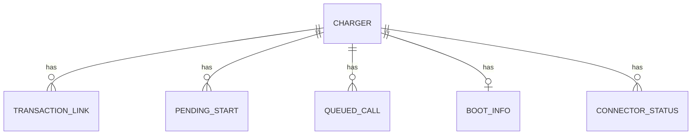

# Entity Model

The proxy has no database. Chargers come from the configuration file; the rest is persisted as one state file per charger. Entities below describe that data.

## Entity Relationship Diagram

### CHARGER

A charge point on the allowlist that may connect through the proxy.

| Attribute    | Description                                                              | Data Type | Length/Precision | Validation Rules                              |
|--------------|--------------------------------------------------------------------------|-----------|------------------|-----------------------------------------------|
| id           | Charger id used in the connection address (letters, digits, . _ -)       | String    | 64               | Primary Key                                   |
| password     | Optional password the charger must present (read from the environment)   | String    | -                | Optional                                      |
| primary_id   | Id of the charger at the primary backend; defaults to id                 | String    | 64               | Not Null                                      |
| secondary_id | Id of the charger at the secondary backend; defaults to id               | String    | 64               | Not Null                                      |

### TRANSACTION_LINK

Pairing of the primary backend's and the secondary backend's number for the same charging transaction.

| Attribute              | Description                                   | Data Type | Length/Precision | Validation Rules                      |
|------------------------|-----------------------------------------------|-----------|------------------|---------------------------------------|
| charger_id             | Charger the transaction belongs to            | String    | 64               | Primary Key, Foreign Key (CHARGER.id) |
| primary_transaction_id | Transaction number issued by the primary      | Long      | 19               | Primary Key                           |
| secondary_transaction_id | Transaction number issued by the secondary  | Long      | 19               | Not Null                              |

#### Constraints

- Composite primary key (charger_id, primary_transaction_id).

### PENDING_START

A transaction number from one backend waiting for the other backend's number for the same start message.

| Attribute      | Description                                                  | Data Type | Length/Precision | Validation Rules                      |
|----------------|--------------------------------------------------------------|-----------|------------------|---------------------------------------|
| charger_id     | Charger the start belongs to                                 | String    | 64               | Primary Key, Foreign Key (CHARGER.id) |
| start_ref      | Identifier of the charger's start message                    | String    | -                | Primary Key                           |
| origin         | Backend whose number is already known                        | String    | -                | Not Null, Values: PRIMARY, SECONDARY  |
| transaction_id | Transaction number issued by that backend                    | Long      | 19               | Not Null                              |

#### Constraints

- Composite primary key (charger_id, start_ref, origin).
- At most 100 pending starts per charger and origin; the oldest is dropped.

### QUEUED_CALL

A billing message (transaction start, stop or meter reading) waiting for delivery to the secondary backend.

| Attribute  | Description                                                           | Data Type | Length/Precision | Validation Rules                      |
|------------|-----------------------------------------------------------------------|-----------|------------------|---------------------------------------|
| id         | Unique identifier, defines delivery order                             | Long      | 19               | Primary Key, Sequence                 |
| charger_id | Charger that sent the message                                         | String    | 64               | Not Null, Foreign Key (CHARGER.id)    |
| action     | Message type                                                          | String    | -                | Not Null, Values: StartTransaction, StopTransaction, MeterValues |
| payload    | Message content with the original timestamps                          | String    | -                | Not Null                              |
| start_ref  | Identifier correlating a start with the primary's answer              | String    | -                | Optional                              |

### BOOT_INFO

The charger's last boot notification, resent when the secondary backend reconnects.

| Attribute  | Description                      | Data Type | Length/Precision | Validation Rules                      |
|------------|----------------------------------|-----------|------------------|---------------------------------------|
| charger_id | Charger the boot belongs to      | String    | 64               | Primary Key, Foreign Key (CHARGER.id) |
| payload    | Content of the boot notification | String    | -                | Not Null                              |

### CONNECTOR_STATUS

The last reported status of one connector of a charger.

| Attribute    | Description                           | Data Type | Length/Precision | Validation Rules                      |
|--------------|---------------------------------------|-----------|------------------|---------------------------------------|
| charger_id   | Charger the connector belongs to      | String    | 64               | Primary Key, Foreign Key (CHARGER.id) |
| connector_id | Connector number (0 is the charger)   | Integer   | 10               | Primary Key                           |
| payload      | Content of the status notification    | String    | -                | Not Null                              |

#### Constraints

- Composite primary key (charger_id, connector_id).
